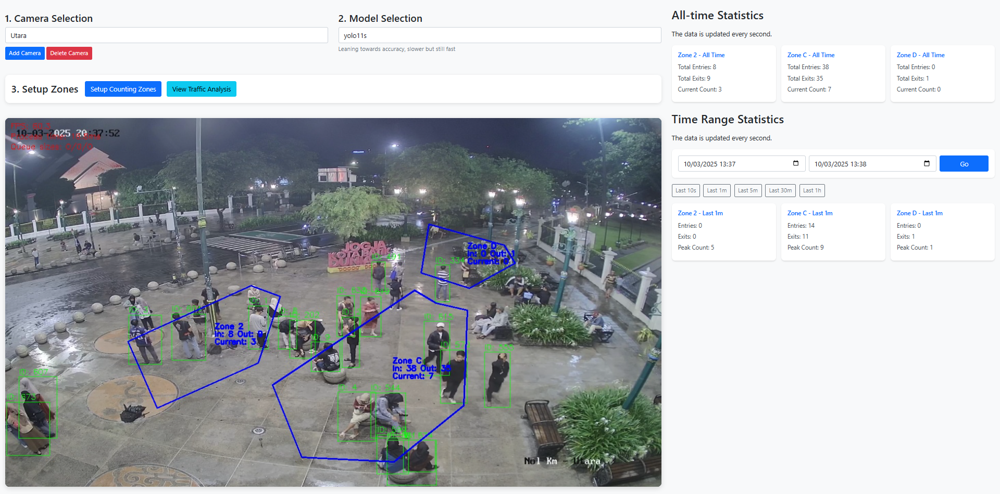

# Live People Counter from CCTV Footage
<p align="center"></p>
<h4 align="center" src=""><a href="https://drive.google.com/file/d/1DxCIQxTgGepVaHLXV0MROKDkCCIpOg-w/view?usp=sharing">🔗 Project Demo</a></h4>

## 🔗 README Quick Links
[Technical Notes](https://github.com/adityojulian/live-people-counter/blob/main/TECHNICAL_README.md) - for more details on how the detection and tracking works.

[API Documentation](https://github.com/adityojulian/live-people-counter/blob/main/API_README.md) - for more details on all available endpoint implemented in this system.

[People Counter Class](https://github.com/adityojulian/live-people-counter/blob/main/modules/README.md) - for more details on the functionalities and implementation of the main module (detection and tracking).

[Project Demo](https://drive.google.com/file/d/1DxCIQxTgGepVaHLXV0MROKDkCCIpOg-w/view?usp=sharing) - usage demonstration of the application

## 📌 Table of Contents
[1. Object Detection & Tracking Process](#1-object-detection--tracking-process)

[2. Database Structure and Diagram](#2-database-structure-and-diagram)

[3. Video/Dataset Source](#3-videodataset-source)

[4. API Endpoints](#4-api-endpoints)

[5. Dashboard Overview](#5-dashboard-overview)

[6. How to Run the System](#6-how-to-run-the-system)
- [Pre-requisites](#pre-requisites)
- [Using Docker (Recommended)](#using-docker-recommended)
- [Changing YOLO Model](#changing-yolo-model)
- [Running Without GPU](#running-without-gpu)
   
[7. Troubleshooting](#7-troubleshooting)

[8. Test Environment](#8-test-environment)

[9. Feature Checklist](#9-feature-checklist)

## 1. Object Detection & Tracking Process
This mechanism is heavily influenced by the `PoepleCounterNew()` class. The documentation for this class can be found [here](https://github.com/adityojulian/live-people-counter/tree/main/modules). In general, the implementation utilizes multi-threading for capturing frame from CCTV, inferencing, and output generating. There are several queues being utilized to support the multi-threading implementation: `frame_queue`, `results_queue`, and `output_queue`. These queues ensure real-time processing for the system. 

### Step-by-Step Process
Please refer to this page for the process flow diagram of the object detection and tracking and the counting mechanism.

1.  **Capture Video Frames**
    -   Reads frames from a [**live CCTV footage**](https://cctvjss.jogjakota.go.id/malioboro/NolKm_Utara.stream/playlist.m3u8).
2.  **Detect People with YOLO**
    -  Runs **YOLO object detection** to find **people in the frame**.
    - By default, the model being used is the yolo11-small or `yolo11s` from [Ultralytics](https://docs.ultralytics.com/models/yolo11/). If the program becomes too heavy to run, try changing to a smaller model by modifying the `Dockerfile` as specified [here](#changing-yolo-model).
3.  **Track Individuals with ByteTrack**
    -   Assigns **unique tracking IDs** to detected people.
4.  **Check If Inside a Zone**
    -   Extracts the **centroid of the bounding box**.
    -   Uses **OpenCV polygon test** to determine if a person is inside a polygon zone.
5.  **Update Counter & Store Data**
    -   Updates **entry/exit counts** for each zone. A person is considered to have entered the zone if and only if their state change from `isInside() = False` to `isInside() = True`. These states are stored in a variable for each detected and tracked person, though it only stores the last five states. Automatic deletion or popping is implemented for this variable.
    -   Saves the **zone count logs** to the database.
6.  **Generate Overlay & Stream to Web**
    
    -   Draws **bounding boxes and counters** on the video.
    -   Streams the **processed video** to the web dashboard.


## 2. Database Structure and Diagram

The system uses **SQLite** to store data related to **zones** and **counting logs**.

### Database Schema

-   **Zone Table (`Zone`)**
    -   Stores **polygonal areas** (zones) where counting occurs.
    -   Fields: `id`, `name`, `points`, `active`, `created_at`
-   **Zone Count Table (`ZoneCount`)**
    -   Stores **entry/exit counts** for each zone.
    -   Fields: `id`, `zone_id (id, foreign from Zone table)`, `timestamp`, `entries`, `exits`, `current_count`


-   The **`Zone`** table stores **polygon coordinates** and **zone name**.
-   The **`ZoneCount`** table tracks **how many people enter/exit each zone**.
-   When a person is detected inside a zone:
    -   The **entry count** increases when a person **enters**.
    -   The **exit count** increases when a person **leaves**.
-   This ensures that **historical zone data** is stored for analytics.

## 3. Video/Dataset Source

The **video stream** is obtained from **CCTV cameras**.

-   **Example CCTV Source (Currently tried):**
    
    ```plaintext
    https://cctvjss.jogjakota.go.id/malioboro/NolKm_Utara.stream/playlist.m3u8
    https://cctvjss.jogjakota.go.id/malioboro/NolKm_GdAgung.stream/playlist.m3u8
    https://eofficev2.bekasikota.go.id/backupcctv/m3/Depan_SMP_Strada_Budi_luhur.m3u8
    ```

## 4. API Endpoints
A more detailed  API documentation can be found [here](./API_README.md). For simplicity, any time-related properties and features are using UTC (GMT+0) timezone.
| Endpoint | Method | Description | 
|------------------------|--------|------------------------------------------------------|
| **Camera Management** |
| `/cameras` | `GET` | Get list of available cameras. |
| `/cameras` | `POST` | Add a new camera. |
| `/cameras/<camera_id>` | `DELETE` | Deactivate a camera. |
| `/cameras/switch/<camera_id>` | `POST` | Switch to a different camera. |
| **Model Management** |
| `/model` | `GET` | Get available models and current selection. |
| `/model` | `POST` | Change the active model. |
| **Video Streaming** | 
|  `/video_feed` | `GET` | Stream processed video with detection and tracking. |
| **Zone Management** |
| `/zones` | `GET` | Get a list of active counting zones. | 
| `/zones` | `POST` | Create or update multiple counting zones. |
| `/zones/<zone_id>` | `PUT` | Update an existing zone. | 
| `/zones/<zone_id>` | `DELETE` | Deactivate a zone. | | `/zones/new` | `POST` | Create a new zone. |
| **People Count Statistics** |
| `/stats` | `GET` | Retrieve the latest or historical zone statistics. |
| `/graph-data` | `GET` | Get historical data for visualization. |

## 5. Dashboard Overview
-   **Configuration Options**
    1. **Camera Selection**
        - Choose from multiple CCTV sources
        - Add new camera sources via URL
        - Delete unused camera sources
        - Each camera maintains its own zones and statistics
        
        > ⚠ Please note that the current implementation does not run multiple cameras concurrently, which means the detection and tracking do not run simultaneously for all cameras.

        > 💡 If you run the program on the background (without browser), the tracking for selected camera will keep running and the all statistics will keep getting updates.

    2. **Model Selection**
        - Choose from different YOLO models:
            - YOLOv8n: Fastest, lowest accuracy
            - YOLO11n: Balance of speed and accuracy
            - YOLO11s: Higher accuracy, slower speed
        - Switch models in real-time based on performance needs
    3. **Zone Setup**
        - Configure counting zones specific to each camera
        - Zones and statistics are maintained separately per camera

-   **Live Video Feed** 📹
    - Displays **real-time people tracking** with bounding boxes
    - Shows all configured zones for the current camera
-   **Zone Statistics**
    - It shows **entry/exit counts** for each zone.
    - It displays current occupancy per zone
    - Zone statistics can be filtered using quick presets (e.g., last 5s, last 1m, last 1h) or a custom datetime range.
    > ⚠ Statistics are maintained separately for each camera
-   **Graph Visualization** 📈
    - Provides **historical trends** of people movement
    - Filter by datetime range
    - View data specific to each camera source

## 6. How to Run the System
### Pre-requisites
- [Docker](https://docs.docker.com/get-docker/)=
- NVIDIA GPU with CUDA support (recommended)
- Running Docker Engine


### **Using Docker (Recommended)**

1.  **Clone the repository**
    
    ```bash
    git clone https://github.com/adityojulian/live-people-counter.git
    cd live-people-counter
    ```
    
2.  **Start the system**
    
    ```bash
    docker-compose up --build
    ```
    
3.  **Access the web dashboard**
    
    -   Open: [http://localhost:5000](http://localhost:5000/)

4. **Initial Setup**
    1. Add a camera source using the "Add Camera" button
    2. Select appropriate YOLO model based on your hardware capabilities
    3. Configure counting zones for your camera

5. **(Optional) Fresh Database**: 
    - If you want you can use a fresh database without any records by comment and uncommenting these lines on `app.py`
    ```python
    # Comment line below if you want to use a fresh db
    app.config['SQLALCHEMY_DATABASE_URI'] = 'sqlite:///test.db' 
    
    # Uncomment line below to use a fresh db
    # app.config['SQLALCHEMY_DATABASE_URI'] = 'sqlite:///freshdb.db'
    ```

### **Changing YOLO Model**

You can change the model in through the dashboard by using the "Model Selection" dropdown. The changes should take effect immediately.

### **Running Without GPU**

If you **don’t have a GPU**, update the `Dockerfile`:

```Dockerfile
FROM python:3.9-slim # Line 1
RUN pip3 install torch torchvision torchaudio --index-url https://download.pytorch.org/whl/cpu # Line 29
```

## 7. Troubleshooting

### **1. Cannot Access Web Interface**
-   Ensure the container is **running**:
    
    ```bash
    docker-compose ps
    ```
    
-   Check logs:
    ```bash
    docker-compose logs people-counter
    ```

### **2. Slow Performance**
-   Verify **GPU acceleration**:
    ```bash
    docker exec -it people-counter_people-counter_1 nvidia-smi
    ```
- Run `docker ps -a` to see exact container name.
    
### **3. No Camera Feed**
- Verify the camera URL is accessible
- Check network connectivity
- Try switching to a different camera source
- Ensure the stream format is compatible (RTSP/HTTP)
- Live footage from CCTV can be laggy or not available. Kindly change the URL if that's the case.

## 8. Test Environment
### Software Versions
- **Host Operating System:** Windows 10
- **Python:** 3.10
- **CUDA:** 11.8
- **Docker:** 27.5.1, build 9f9e405
- **Docker Compose:** v2.32.4-desktop.1

### Performance Notes
- **Model used**: `yolo11s`
- **Frame processing**: 70-90 FPS (Average: 81.8 FPS) on RTX 3070
- **Processing time**: 10 - 25ms per frame
- **Memory usage**: ~13 GB RAM during operation
- **GPU utilization**: 7-13% depending on model

## 9. Feature Checklist
- [x] Database Design (Done)
- [x] Dataset Collecting (Done)
- [x] Object Detection & Tracking (Done)
- [x] Counting & Polygon Area (Done)
- [] Prediksi (Forecasting) (x)
    - Issue: Time contraints
- [x] API Integration (API/Front End) (Done)
- [x] Deployment (Done)