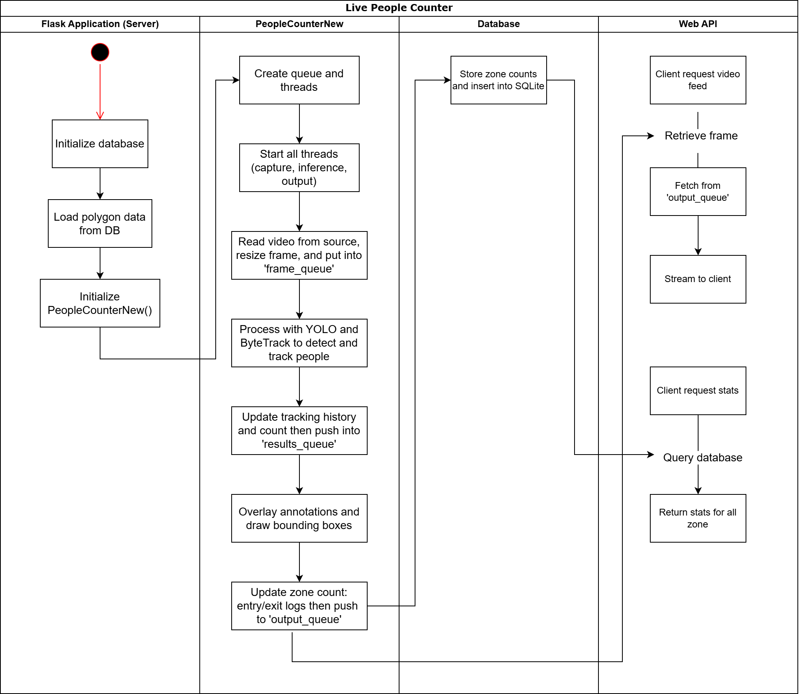

# Technical Notes on Object Detection and Tracking Implementation



The diagram provides a process flow for the Live People Counter system, breaking it into four main components:
1. Flask Application (Server)
2. PeopleCounterNew (Processing & Tracking)
3. Database (Storage)
4. Web API (Client Interaction)

## 1. Flask Application (Server) Initialization
- The server initializes the **database**.
- It then **loads polygon data** from the database. These polygons represent **zones** where people are counted.
- Finally, it **initializes `PeopleCounterNew()`**, which manages the object detection and tracking.

## 2. People Counting & Tracking (`PeopleCounterNew`)
This component handles **video processing**, **object detection**, and **tracking**.

### **Step-by-Step Process:**
1. **Create Queues and Threads**
   - The system initializes **multiple threads** to handle different tasks asynchronously:
     - **Capture video frames**
     - **Run YOLO detection & ByteTrack tracking**
     - **Overlay annotations**
     - **Store results**

2. **Start All Threads**
   - The video processing pipeline begins by reading the video feed, capturing frames, and **resizing** them.
   - Each frame is placed in `frame_queue` for further processing.

3. **Object Detection & Tracking**
   - The system runs **YOLO** to detect people in the frame.
   - **ByteTrack** is used to track the detected individuals.
   - The **tracking history** is updated and stored in `results_queue`.

4. **Overlay Annotations**
   - Bounding boxes and other graphical elements are drawn on the frame.

5. **Update Zone Counts**
   - The system checks whether a detected person is inside a defined zone.
   - Entry/exit counts are updated and **pushed to `output_queue`**.

### **Logic for Detecting If a Person is Inside a Defined Zone and Entry/Exit Counts**  

#### 1. Defining a Zone
A **zone** is defined as a polygon with multiple coordinate points. These polygons are pre-configured and stored in the database. Each zone is represented as:  

```python
zone = [(x1, y1), (x2, y2), (x3, y3), ..., (xn, yn)]
```
where:
- $(x_i, y_i)$ represents the coordinates of the **polygon's vertices**.
- The polygon is stored in the **Zone table** in SQLite.

#### 2. Determining If a Person is Inside a Zone
Each detected person is represented by a **bounding box** with a center point (centroid). The centroid is computed as:  

$C_x = \frac{x_{\text{min}} + x_{\text{max}}}{2}, \quad C_y = \frac{y_{\text{min}} + y_{\text{max}}}{2}$

here:
- $(x_{\text{min}}, y_{\text{min}})$ and $(x_{\text{max}}, y_{\text{max}})$ are the top-left and bottom-right coordinates of the **bounding box**.

To check whether this centroid is inside a polygon, this implementation use **OpenCV's `pointPolygonTest`** function:

```python
import cv2
import numpy as np

def is_inside_zone(centroid, zone_polygon):
    # Convert the list of points into a NumPy array
    poly = np.array(zone_polygon, dtype=np.int32)
    
    # Use OpenCV pointPolygonTest function
    inside = cv2.pointPolygonTest(poly, centroid, False)
    
    # Returns True if the point is inside the polygon
    return inside >= 0
```
- If `pointPolygonTest` returns >= 0, the person is **inside** the zone.
- If `pointPolygonTest` returns < 0, the person is **outside** the zone.

#### **3. Tracking Entry and Exit Events**
Each detected person has a **unique tracking ID**, assigned using **ByteTrack**. We maintain a **tracking history** of their last few states.

#### **Logic for Entry Count**
A person is considered to have **entered a zone** if:
1. In the **previous frame**, they were **outside** (`isInside() = False`).
2. In the **current frame**, they are **inside** (`isInside() = True`).

This is implemented as:

```python
def detect_entry(person_id, previous_states, current_state):
    if len(previous_states[person_id]) > 0 and not previous_states[person_id][-1] and current_state:
        return True
    return False
```
- `previous_states[person_id]` stores the **last few states** of a person (inside or outside).
- The function checks if the last recorded state was **False** and the current state is **True**.
- If **entry is detected**, the count is incremented.

#### **Logic for Exit Count**
A person is considered to have **exited a zone** if:
1. In the **previous frame**, they were **inside** (`isInside() = True`).
2. In the **current frame**, they are **outside** (`isInside() = False`).

Implemented as:

```python
def detect_exit(person_id, previous_states, current_state):
    if len(previous_states[person_id]) > 0 and previous_states[person_id][-1] and not current_state:
        return True
    return False
```
- If the person was **inside** in the last frame but **outside** in the current frame, it counts as an **exit**.